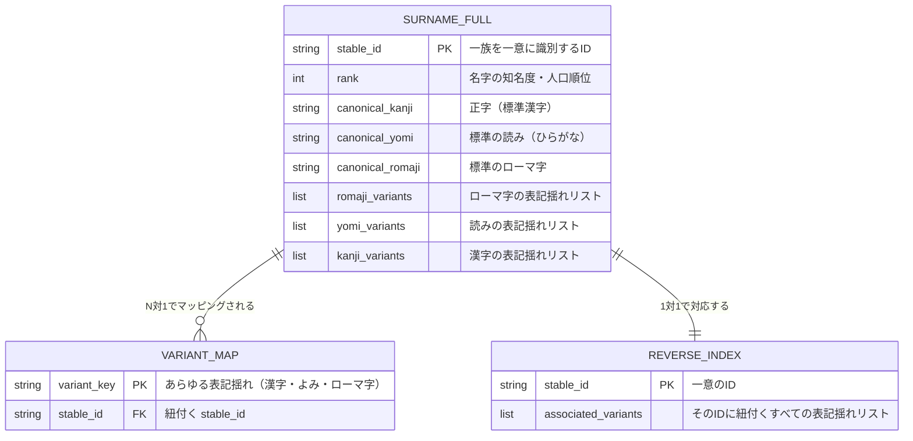
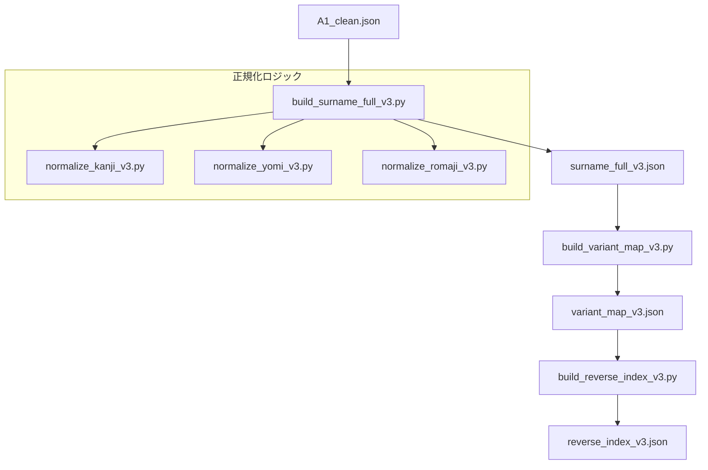
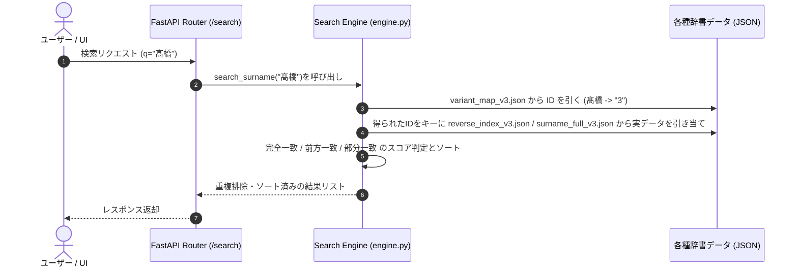

# KAMON-v3 技術仕様書

このドキュメントでは、日本の名字（姓）を正規化し、検索するためのシステム「KAMON-v3」のデータ構造、データフロー、および主要なロジックについて解説します。

---

## 1. 全体構造と役割

KAMON-v3は、名字の表記揺れ（異体字、読み、ローマ字）を吸収し、単一の識別子（`stable_id`）に集約することで、高精度な名前の検索や名寄せを実現するシステムです。

システムは大きく分けて以下の2つのフェーズで構成されています。

```
[ビルドフェーズ] 
Rawデータ (A1_clean.json) 
   │
   ▼ (normalize_dv3/ のスクリプト群)
最適化されたJSON辞書群の生成 (data/surname/)

[サービスフェーズ]
ユーザー入力 (UI / API)
   │
   ▼ (api_v3/app/ のFastAPI & 検索エンジン)
正規化・スコアリングされた検索結果の返却
```

---

## 2. データ構造（データモデル）

辞書データはリレーショナルデータベースではなく、高速なオンメモリ読み込みが可能なJSONファイル群として構築されています。それぞれのデータの関係性は、`stable_id` をキーとして紐付いています。

### 概念的なER図 (データ間のリレーション)



### データのサンプル

#### ① `variant_map_v3.json` (キーからIDへのフラットなマッピング)
あらゆる入力（漢字、ひらがな、カタカナ、ローマ字）を `stable_id` に繋ぐためのハッシュマップです。
```json
{
  "佐藤": "1",
  "さとう": "1",
  "sato": "1",
  "髙橋": "3",
  "高橋": "3"
}
```

#### ② `reverse_index_v3.json` (IDからキーリストへのマッピング)
IDに紐付くすべての表記バリエーションを逆引きするためのマップです。
```json
{
  "3": [
    "Takahashi",
    "takahashi",
    "たかはし",
    "タカハシ",
    "高橋",
    "髙橋"
  ]
}
```

#### ③ `surname_full_v3.json` (完全な名字情報)
名字のメタデータ、および正規化された代表値（Canonical）とバリエーションの全体像です。
```json
[
  {
    "stable_id": "3",
    "rank": 3,
    "canonical_kanji": "高橋",
    "canonical_yomi": "たかはし",
    "canonical_romaji": "takahashi",
    "romaji_variants": ["Takahashi", "takahashi"],
    "yomi_variants": ["たかはし"],
    "kanji_variants": ["高橋", "髙橋"]
  }
]
```

---

## 3. データ処理フロー

### ① 辞書ビルドパイプライン (`normalize_dv3/`)
元データから辞書ファイルをビルドする際、漢字・読み・ローマ字の正規化スクリプトが走り、表記揺れをすべて抽出してJSONへコンパイルします。



### ② 検索処理フロー
APIで検索が行われる際のデータの流れです。



---

## 4. コアロジックの補足

### A. 正規化のルール
* **漢字**: `normalization_rules.json` のマッピングを利用して「嶋 ➔ 島」「﨑 ➔ 崎」「髙 ➔ 高」のように、旧字体・異体字を新字体（正字）へ統一します。
* **読み**: カタカナをひらがなに統一し、スペースや中黒（`・`）を取り除きます。
* **ローマ字**: 小文字化し、長音表記（`oo`, `ou`, `oh`, `ō`）の揺れを統一します。

### B. 検索ロジックの実装（解説）
検索ロジック [api_v3/app/services/search/engine.py](../api_v3/app/services/search/engine.py) は、以前は `reverse_index_v3.json`（ID ➔ 名前リストの構造）を「名前 ➔ ID」のマップとして検索しようとするバグがあり、結果が常に空になる状態でした。

現在は以下のようにロジックが修正・最適化されています。
1. **マッピングの再配置**:
   * 完全一致・前方一致・部分一致の照合元として、すべてのバリエーションが登録されている `variant_map_v3.json`（名前 ➔ ID）を走査する形に変更されました。
2. **高速化（O(1) ルックアップ）**:
   * メモリ上にロードされた `FULL` リストを、起動時に `FULL_DICT`（ID ➔ オブジェクト）のハッシュマップに変換して保持することで、マッチしたIDに対応する実データの検索を高速化しています。
